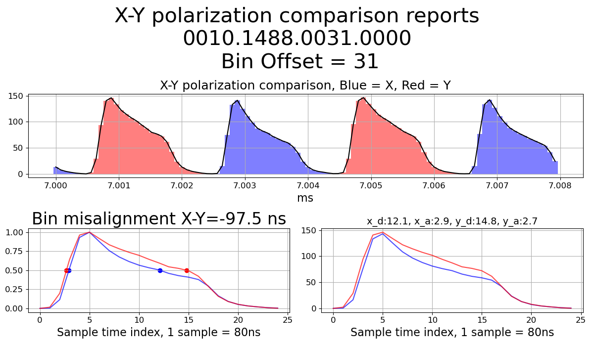
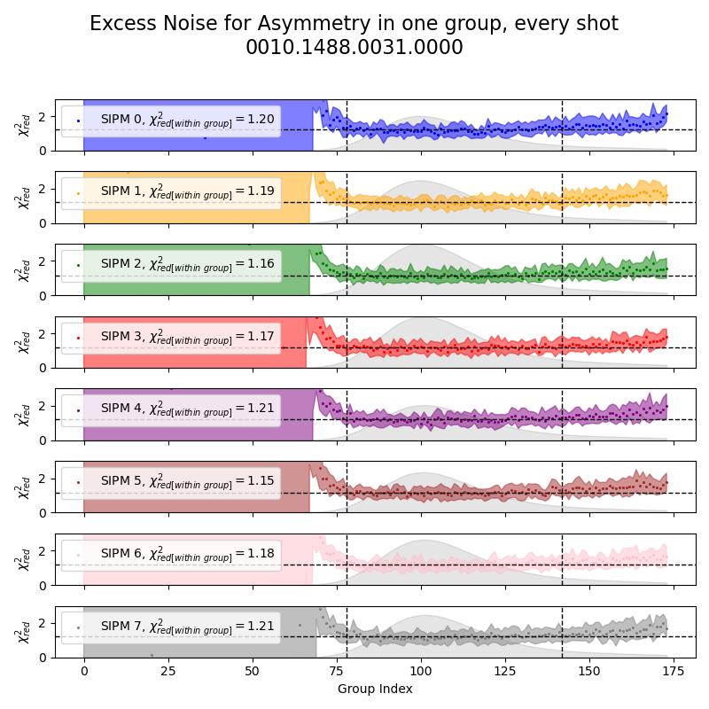
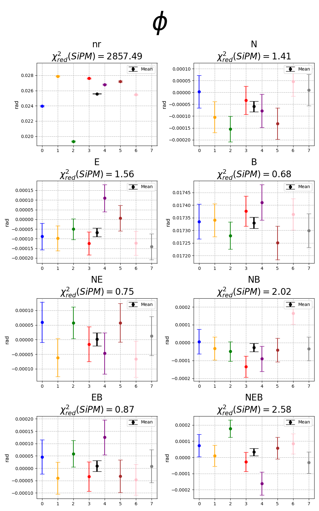
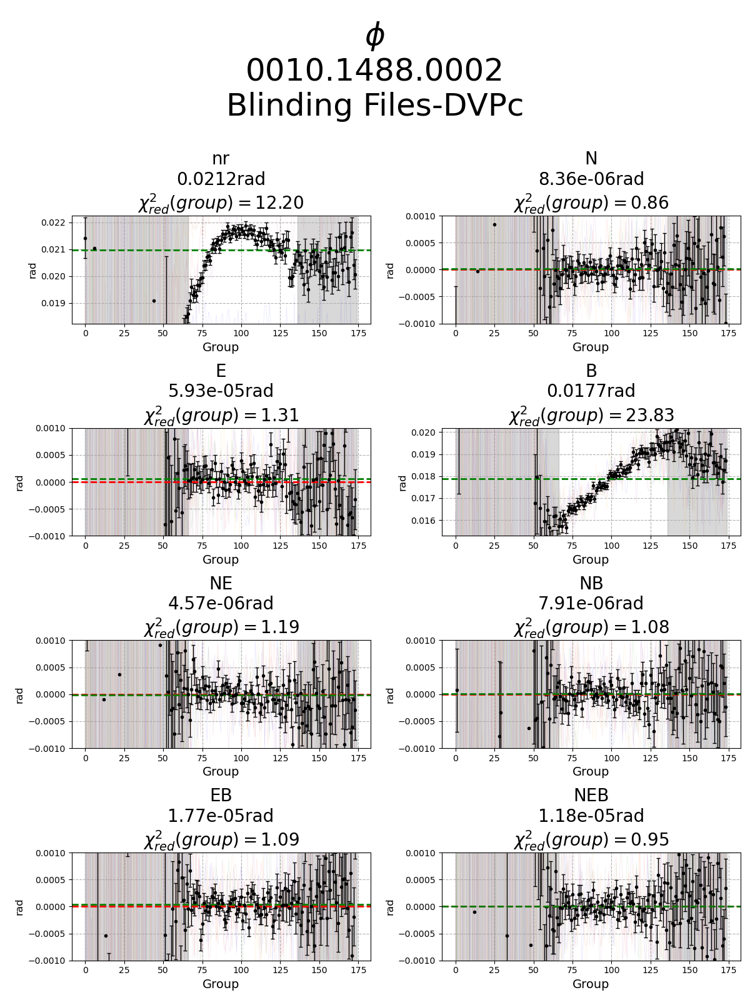
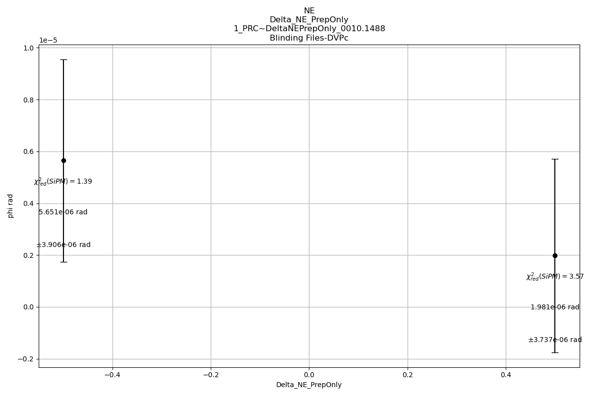
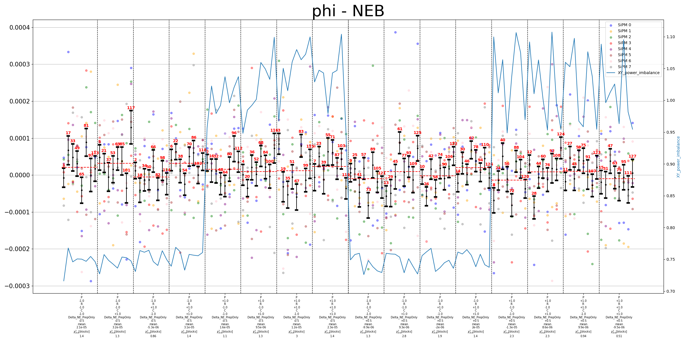

To analyze ACME III data, please use the \workbench\workbench.ipynb.

- Data and header files will be automatically downloaded at C:\ACMEdata from ACME NAS

- Analysis Result will be created as a sub folder at C:\ACME_analysis, with your specified name. For example, "EnrSlope" folder with data from 0010.1488 will be created at C:\ACME_analysis\EnrSlope0010.1488. 

- Modify analysis parameters in the subfolders in the C:\ACME_analysis\EnrSlope0010.1488\Analysis Parameters folder before starting analysis.

    - **\binpara**: specification of how each trace of data should be processed: polarization switching bin offset should be set, SiPM conversion ratio, electrical background substraction methods.

    - **\bincut**: specification of which part of the trace data should be contained/excluded.

    - **\blockpara**: specification of how block level results of "N","E","theta","B" channels parity quantity should be calculated from every 64/32 traces.

    - **\blockcut**: specification of when a block of data should be excluded (i.e. signal too low due to unlocked lasers)

    - **\config**: reserved for future.

    - **\sequence**: specification of experiment quantity for IPV (intentional parameter variation) scans

- Multiple json files can exist in the same sub folder. Calculations will be done with **every possible combinations** of (binpara) x (bincut) x (blockpara) x (blockcut) x (config), and be stored as a seperate result subfolder in C:\ACME_analysis\EnrSlope0010.1488\Run Results. In each result subfolder, all different (sequence) specifications will also be calculated.

- Trace level examination Plot example:

- Block level examination Plot example:

- IPV systematic scan Plot example:

